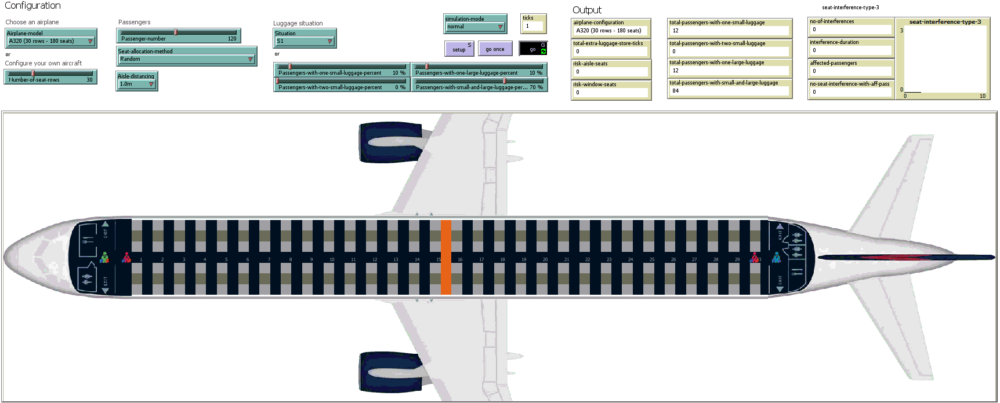
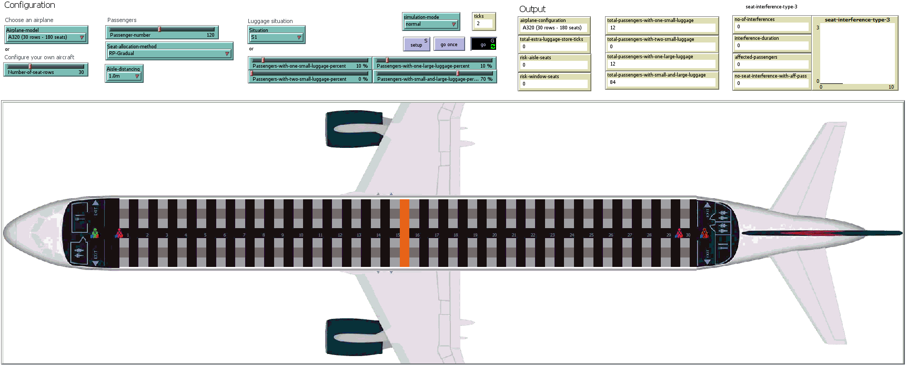

Recordings of the simulations presented in 
### **"Evaluation of Boarding Methods Adapted for  Social Distancing when using Apron Buses"** 
submitted to the `IEEE Access` journal. 

Please feel free to contact us at liviu.cotfas at ase .ro for further details. 

## Boarding Scenarios

All the simulations have been performed using the following settings:
- occupancy level: 100% (120 passengers);
- luggage situation: S1 (described in our paper).

> Suggestions: 
> 1. You can download the animations below in order to watch them at a higher resolution.
> 2. Click on the animations to view the associated video on YouTube.

### Random
#### Aisle distancing: 1.0m

#### Aisle distancing: 2.0m

### Adapted Back-to-front
#### Aisle distancing: 1.0m

#### Aisle distancing: 2.0m

### Adapted Back-to-front mix
#### Aisle distancing: 1.0m

#### Aisle distancing: 2.0m

### WilMA-Back-to-front
#### Aisle distancing: 1.0m

#### Aisle distancing: 2.0m

### WilMA-Spread
#### Aisle distancing: 1.0m

#### Aisle distancing: 2.0m

### WilMA-Spread-Back-to-front
#### Aisle distancing: 1.0m

#### Aisle distancing: 2.0m

### Reverse pyramid - Gradual
#### Aisle distancing: 1.0m

#### Aisle distancing: 2.0m

### Reverse pyramid - Steep
#### Aisle distancing: 1.0m

#### Aisle distancing: 2.0m

### Reverse pyramid - Spread
#### Aisle distancing: 1.0m

#### Aisle distancing: 2.0m
